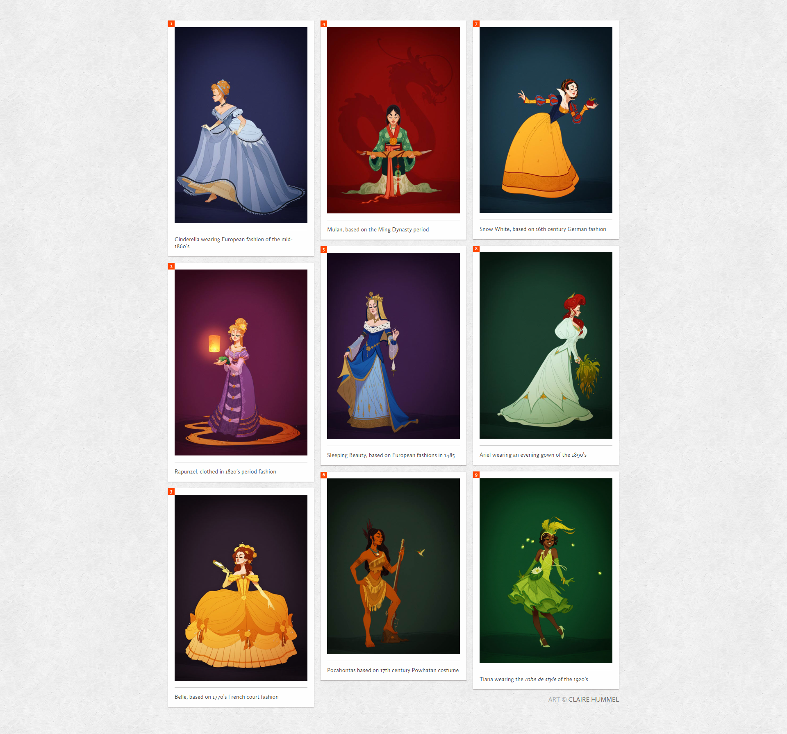
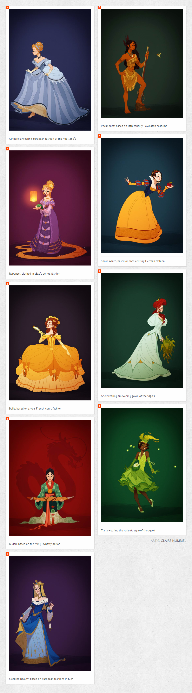
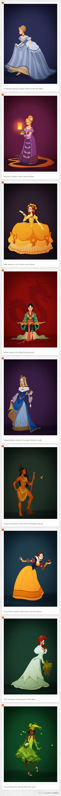

# Responsive Multi-column Layout

This [CodePen example](https://codepen.io/dudleystorey/full/yqrhw/) taught me how to make a masonry layout using column.

[DEMO]()

## Reference

- [CodePen - Dudley Storey](https://codepen.io/dudleystorey/full/yqrhw/)  
- [Art Designer - Claire Hummel](https://clairehummel.com)  
- [Background Image - Toptal](https://www.toptal.com/designers/subtlepatterns/scribble-light/)

## Screenshots

